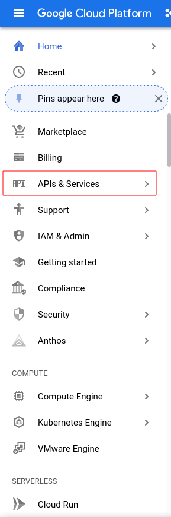
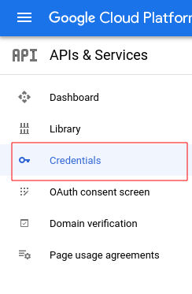
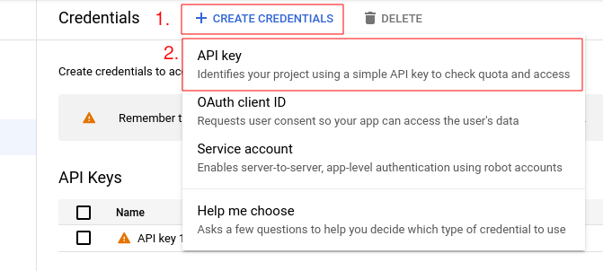

# Self-host the Inference API

## Setup a Google API token for Google Natural Language API

The Valuenet API depends on Google API. Make sure your account has a valid API token to use. Otherwise, use the following procedure to generate an API token:

1. Go on <https://console.cloud.google.com> (login with your personal Google account or create one if you don't have any)
2. Open the *APIs and Services* menu
3. Open the *Credentials* menu
4. Select *CREATE CREDENTIALS* and *API key*

**Please note that you need a valid credit card to enable the Google API and generate a token. It seems like prepaid credit cards are not accepted. Google say that you won't be charged automatically so you should not worry about being billed.**

Here are some screenshots to help you find the menus in the Google console interface.

